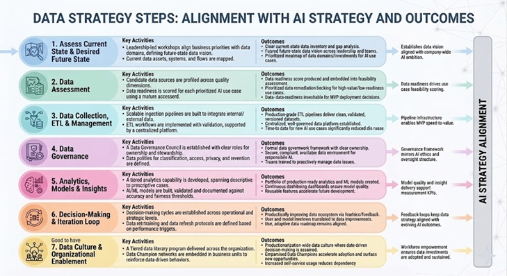

Author: Navita Singh

First Draft: 2 June 2026

# Context: Data Strategy that aligns with business and AI strategy

Before any AI initiative can succeed, the organization must develop a clear understanding of its current data state and its desired future state. This foundational step aligns data discovery with the top-down and bottom-up engagement model of the AI strategy, ensuring both leadership and front-line teams contribute to shaping the data vision.

| # | Data Strategy Step | AI Strategy Step | Primary Alignment |
|---|--------------------|------------------|--------------------|
| 1 | Assess Current State & Desired Future State | Step 1 | Establishes data vision aligned with company-wide AI ambition |
| 2 | Data Assessment | Step 2 | Data readiness drives use case feasibility scoring |
| 3 | Data Collection, ETL & Management | Step 2 | Pipeline infrastructure enables MVP speed-to-value |
| 4 | Data Governance | Step 3 | Governance framework mirrors AI ethics and oversight structure |
| 5 | Analytics, Models & Insights | Step 4 | Model quality and insight delivery support measurement KPIs |
| 6 | Decision-Making & Iteration Loop | Steps 2–4 | Feedback loops keep data strategy aligned with evolving AI outcomes |
| 7 | *[Good to have step] Data Culture & Organizational Enablement* | Steps 1,3,4 | Workforce empowerment ensures data investments are adopted and sustained |

## Step 1. Assess current state and desired future state

**Key Activities**: Leadership-led workshops align business priorities with key data domains and define a future-state data vision. Current data assets, systems, and flows are mapped, while teams surface gaps and pain points through hackathons and surveys. Cross-functional alignment is built to connect data investments with AI strategy.

**Outcomes**: A clear current-state data inventory and gap analysis is created. A shared future-state data vision is agreed across leadership and teams. A prioritized roadmap of data domains and investments is defined to enable AI use cases.

## Step 2. Data assessment

The organization must rigorously assess the quality, completeness, and trustworthiness of its data assets relative to each prioritized AI use case. This step directly supports the evaluation of the AI strategy's value versus feasibility. Data readiness is a primary feasibility driver that determines which use cases are viable for early wins.

**Key Activities:** Candidate data sources are profiled across quality dimensions such as completeness, accuracy, timeliness, consistency, and lineage. Data readiness is scored for each AI use case using a structured maturity scorecard. Gaps, duplications, and accessibility constraints (APIs, permissions, latency, formats) are identified, along with evaluation of data trustworthiness and bias risks.

**Outcomes**: A data readiness score is produced for each AI use case and embedded into the feasibility assessment. A prioritized data remediation backlog is created for high-value but low-readiness use cases. Clear data-readiness thresholds are defined to guide MVP deployment decisions.

## Step 3. Data collection, ETL and management

This step operationalizes the data pipeline infrastructure needed to bring raw data to a state suitable for AI model training, evaluation, and deployment. Efficient Extract, Transform, Load (ETL) processes and robust data management practices are the engineering backbone of feasible AI use cases.

**Key Activities**: Scalable ingestion pipelines are built to integrate internal and external data sources into a unified flow. ETL workflows are implemented with validation checkpoints, supported by a centralized data platform serving as a single source of truth. Data versioning, lineage tracking, and automated refresh cycles are established, along with governance policies for retention and deletion.

**Outcomes**: Production-grade ETL pipelines deliver clean, validated, and versioned datasets for AI teams. A centralized, well-governed data platform with clear metadata and access controls is established. Time-to-data for new AI use cases is significantly reduced through reusable pipeline infrastructure.

## Step 4. Data governance

Data governance is the organizational and technical framework that ensures data is managed as a trusted, secure, and compliant asset across its entire lifecycle. This step mirrors AI governance, embedding data accountability, ethical data use, and regulatory compliance into the culture of the organization rather than treating them as afterthoughts.

**Key Activities**: A Data Governance Council is established with clear roles for owners, stewards, and custodians. Data policies are defined for classification, access, privacy, retention, and sharing, supported by a centralized data catalogue. Governance is embedded into ETL pipelines through quality standards and Service Level Agreements (SLAs), aligned with regulatory and AI ethics requirements, alongside workforce training in data stewardship.

**Outcomes**: A formal data governance framework with clear ownership and accountability is implemented. A secure, compliant, and auditable data environment is established to support responsible AI. Teams are trained and empowered to proactively manage data quality and compliance issues.

## Step 5. Analytics, models and insights

With trusted, governed data in place, the organization can now generate value through analytics, predictive models, and actionable insights. This step directly supports the AI strategy's measurement framework, ensuring that data products produce reliable, interpretable outputs that can be tracked against defined success metrics.

**Key Activities**: A tiered analytics capability is developed, spanning descriptive to prescriptive use cases, with AI/ML models built, validated, and documented against accuracy and fairness thresholds. Model monitoring is implemented to track drift and degradation, supported by standardized insight delivery channels such as dashboards and APIs. Feature stores and baseline metrics are established to enable reuse and impact measurement.

**Outcomes**: A portfolio of production-ready analytics and ML models with defined performance baselines is created. Continuous monitoring dashboards ensure ongoing model quality and reliability. Reusable features and components significantly accelerate future AI and analytics development cycles.

## Step 6. Decision-making and iteration loop

This step establishes the feedback mechanisms and iteration disciplines that keep data investments continuously aligned with evolving business priorities and AI model performance.

**Key Activities**: Decision-making cycles are established across operational, strategic, and portfolio levels with structured feedback channels for data and AI users. Model retraining and data refresh protocols are defined based on performance triggers and business changes. A live backlog is continuously reprioritized, while lessons learned and periodic reviews ensure alignment with evolving business and regulatory needs.

**Outcomes**: A continuously improving data ecosystem is established through structured iteration and feedback loops. User and model feedback are systematically translated into prioritized data improvements. A live, adaptive data strategy roadmap remains aligned with AI strategy and business objectives.

## Good to have Step 7. Data Culture and Organizational Enablement

Technology and process alone are insufficient to realize the value of data and AI. This final step embeds a data-driven culture across the organization, empowering every team to trust, use, and contribute to the data ecosystem. It directly supports the AI strategy's workforce empowerment pillar and ensures that the data investments made in Steps 1 through 6 are adopted, sustained, and expanded over time.

**Key Activities**: A tiered data literacy program is delivered across the organization, supported by Data Champion networks embedded in business units. Data-driven behaviours are reinforced through recognition systems, while self-service access is enabled via governed BI tools and data marketplaces. Adoption is tracked through surveys and continuous communication of progress and success stories.

**Outcomes**: A strong, organization-wide data culture is established where data-driven decision-making is standard practice. Empowered Data Champions accelerate adoption and surface new opportunities across teams. Increased self-service usage reduces dependency on central teams and improves the speed of AI and analytics delivery.

**Disclaimer:** *Anything mentioned in this article reflects my personal opinion, not any of my current or former employers. This research has been done using publicly available tutorials, press releases, and datasets.*